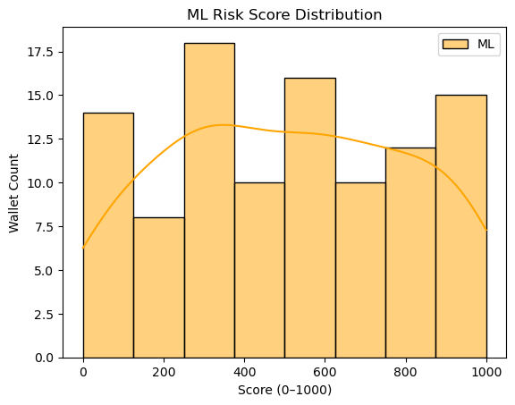

# Wallet Risk score using Compound V2 protocol 


##  Problem Statement

Given a list of wallet address and the objective is to score each wallet id on a sclae of 0-1000,where higher score reflect higher risk based on their lending and borrowing activity in the data obtained from compound v2 protocol.


---

## Data Collection Method

- **Platform Used**: Dune Analytics(https://dune.com)
  - With the help of dune searched for required compound v2 data and queried it.
- **Protocol Analyzed**: Compound V2
- **Tables Queried**:
  - `compound_v2.borrow`
  - `compound_v2.repay`
  - `compound_v2.redeem`
  - `compound_v2.liquidation`
  - `compound_v2.mint`
  - `c20.token`
- **Processing**:
  - Queried each table for relevant wallet level transaction records.
  - Unnecessary columns were dropped.
  - Data from different tables was joined using wallet_id as the primary key.
  - Exported the dataset to a single borrow.csv file

---

##  Feature Selection 

The following columns were selected as features for their direct influence on risk:

| Feature         | Description                                      | Reason for Inclusion                        |
|----------------|--------------------------------------------------|---------------------------------------------|
| `borrowAmount` | Total amount borrowed                            | Indicates debt exposure                     |
| `totalBorrows` | outstanding borrow balance                       | Proxy for sustained borrowing behavior      |
| `repayAmount`  | Total repayments                                 | Mitigates risk                              |
| `mintAmount`   | Total supplied collateral                        | Reflects health of the position             |
| `mintTokens`   | Total tokens minted                              | Alternative collateral indicator            |
| `redeemAmount` | Withdrawals made                                 | Sudden drops in collateral may indicate risk|
| `redeemTokens` | Tokens withdrawn                                 | Matches with above for consistency          |

---

## Risk Scoring Logic

A domain informed raw score was constructed as:
```
raw_score=0.5*borrowAmount+0.3*totalBorrows-0.4*repayAmount-0.2*redeemAmount

```
This formula favors higher borrowing (risk) and penalizes repayments and redemptions (risk reduction).

### ML

1. The raw_score was converted into `risk_label` using quantile-based binning (`qcut`) with 1000 bins.
2. **Model Used**: `RandomForestRegressor` (scikit-learn)
3. **Training**:
   - Input: The selected features (`X`)
   - Target: Pseudo-label (`risk_label`)
4. **Scoring**:
   - The model was trained to predict risk from features.
   - Predicted scores were min-max normalized to the range `[0, 1000]`.

---

## Output

Final output is a CSV file:

```csv
    wallet_id                                  score
  0x0039f22efb07a647557c7c5d17854cfd6d489ef3    990
  0x06b51c6882b27cb05e712185531c1f74996dd988    535
  0x0795732aacc448030ef374374eaae57d2965c16c    397
  0x0aaa79f1a86bc8136cd0d1ca0d51964f4e3766f9    271
  0x0fe383e5abc200055a7f391f94a5f5d1f844b9ae    982
```

# Visualization




## Conclusion
Successfully derived a machine learning–based wallet risk score using on-chain Compound V2 data.
